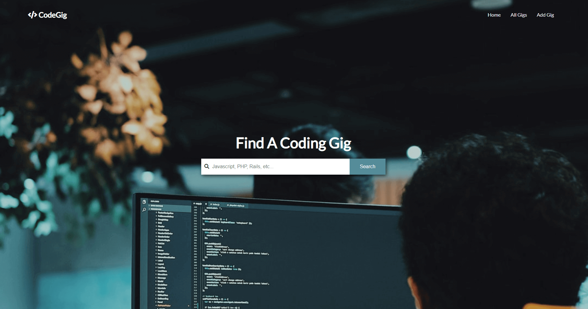
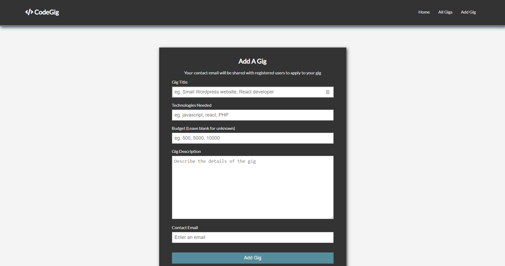

# Code Gig

Simple web app to post a job offer.

## Getting Started

Follow these instructions to get a copy of the project up and running on your local machine for development and testing purposes.

### Prerequisites

You will need <a href="https://nodejs.org/en/">Node.js</a> and <a href="https://www.npmjs.com/">NPM</a>  installed on your system.

## Run the app

1. `npm install`
2. `npm start`
3.  Open http://localhost:3000 or live at 

This app uses postgre sql to store data. You can change the access data in `config/database.js`.

## Built With
<ul>
<li><a href="https://nodejs.org/en/">Node.js</a></li>
<li><a href="https://www.npmjs.com/package/express" rel="nofollow">Express</a></li>
<li><a href="https://www.npmjs.com/package/body-parser" rel="nofollow">Body-Parser</a></li>
    <li><a href="https://www.npmjs.com/package/express-handlebars" rel="nofollow">Express-Handlebars</a></li>
<li><a href="http://docs.sequelizejs.com/" rel="nofollow">Sequelize</a></li>
</ul>